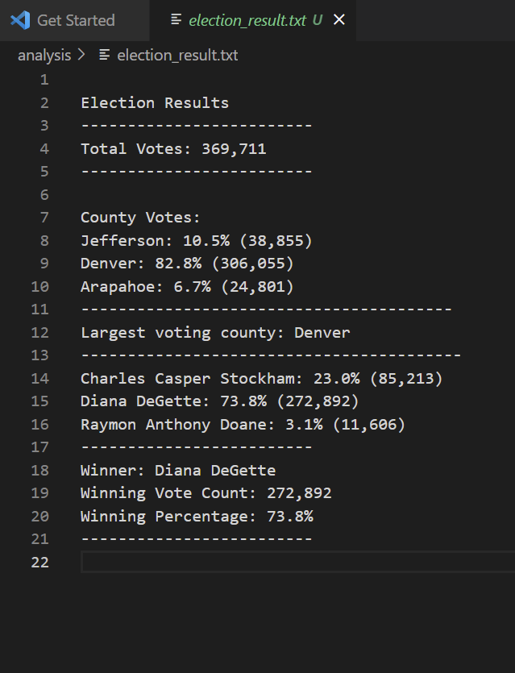

# Election_Analysis
## Purpose of election data analysis:
Tom is a employee of Colorado board of elections, he need to prepare an election audit of the tabulated results for a U.S. congressional precinct in ColoradoTom would like to analyze election data to get election results. We need to obtain following results,
1. Total number of votes cast
2. A complete list of candidates who received votes
3. Total number of votes each candidate received
4. Percentage of votes each candidate won
5. The winner of the election based on popular vote

## Resources:
1.  Data source "election_results.csv"

## Summary:
Data analysis for election data can be devided in three basic group.
1. Prepare the overall results with total number of votes cast.

2. Prepare list of candidate, votes received by candidates in percentage.
 
3. Prepare winner information.
 

## Challeges:
initially it was difficult to analize large amount of data in Excel, however pyton as provided direction to analyze data,validate it. as a new program I need to learn it to implement python data code.

with help of python we can quickly able to analyze large amount of data. we can able to find out the quick summary report as well as minimized the effort. 

# Assignment:-
## Overview of Election Audit:
Colorado board of elections has databsae of election and would like to analyze it to obtain election results and data analysis for candidates and counties.
## Election-Audit Results:
Please refer the following election results,

1. 369,711 voters has casted their votes in this congressional election.
2. Arapahoe county received total 38,855 votes witch is 10.5%.
3. Denver county received total 306,055 votes witch is 82.8%.
4. Jefferson county received total 24,801 votes witch is 6.7%.
5. Denver county has largest number of votes.
6. Charles Casper Stockham has received total 85,213 votes which is 23.0%.
7. Diana DeGette has received total 272,892 votes which is 73.8%.
8. Raymon Anthony Doane has received total 11,606 votes which is 3.1%.
9. Diana DeGette has won the this election with total 272,892 votes which is 73.8% 
## Election-Audit Summary:
we have visualized from this data analysis,
1. Diana DeGette has clearly wont election with high vote margin.
2. Denver county has obtained hightest number of votes in this election.
[Election results from CMD](election_result-cmd.png)

