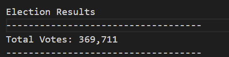
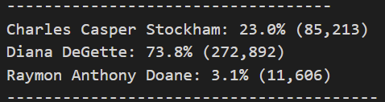
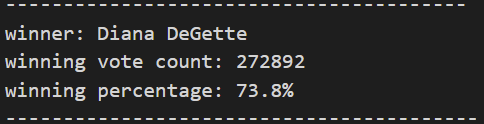
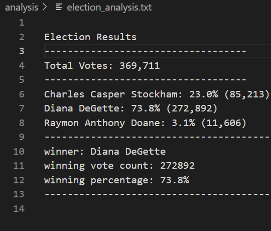

# Election_Analysis
## Purpose of election data analysis:
Tom is a employee of Colorado board of elections, he need to prepare an election audit of the tabulated results for a U.S. congressional precinct in ColoradoTom would like to analyze election data to get election results. We need to obtain following results,
1. Total number of votes cast
2. A complete list of candidates who received votes
3. Total number of votes each candidate received
4. Percentage of votes each candidate won
5. The winner of the election based on popular vote

## Resources:
1.  Data source "election_results.csv"

## Summary:
Data analysis for election data can be devided in three basic group.
1. Prepare the overall results with total number of votes cast.

2. Prepare list of candidate, votes received by candidates in percentage.
 
3. Prepare winner information.
 

## Challeges:
initially it was difficult to analize large amount of data in Excel, however pyton as provided direction to analyze data,validate it. as a new program I need to learn it to implement python data code.

with help of python we can quickly able to analyze large amount of data. we can able to find out the quick summary report as well as minimized the effort. 
